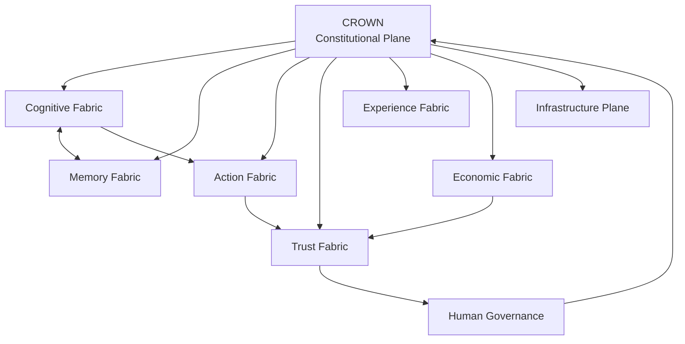

# ISABELLA VILLASEÑOR AI
## Tesis de investigación y Whitepaper de alta ingeniería

### Arquitectura, epistemología, cognición situada y operación soberana

| Campo | Valor |
|---|---|
| Identificador | `ISABELLA-THESIS-V1.0` |
| Documento | 1 de 3 |
| Tipo | Tesis / Whitepaper técnico-académico |
| Arquitectura | Governed Federated Cognitive AI |
| Núcleo constitucional | CROWN |
| Ecosistema | TAMV Online Network · RDM Digital Hub |
| Nodo territorial | Real del Monte, Hidalgo, México |
| Fecha | 27 de agosto de 2026 |
| Estado | Propuesta de investigación y arquitectura objetivo |

> Este documento separa explícitamente hechos comprobados, capacidades reportadas, hipótesis y objetivos de ingeniería. La integración con AOSP, Qualcomm NPU, firmware, QPU, hardware neural o proveedores externos solo puede declararse operativa después de una validación reproducible en el dispositivo y entorno correspondientes.

---

## Resumen

Isabella Villaseñor AI se propone como una infraestructura cognitiva artificial situada, federada y gobernada. Su objetivo es ampliar las capacidades humanas de comprensión, memoria, investigación, creación y ejecución sin convertir el modelo generativo en una autoridad autónoma ni trasladar automáticamente datos sensibles a proveedores externos.

La tesis sostiene que una IA útil para la vida cotidiana y para organizaciones críticas no debe evaluarse únicamente por la calidad lingüística de sus respuestas. Debe evaluarse por la calidad integral del sistema que:

```text
interpreta la intención
→ identifica al actor
→ clasifica los datos
→ recupera contexto
→ formula hipótesis
→ contrasta evidencia
→ selecciona una ruta
→ solicita autorización
→ ejecuta
→ verifica
→ explica
→ registra
→ aprende bajo control
```

La arquitectura combina cinco perspectivas:

```text
cognición situada
+ soberanía de datos
+ agencia limitada
+ evidencia reproducible
+ gobernanza humana
```

---

# 1. Planteamiento del problema

## 1.1 Agentes desacoplados

Los agentes conversacionales convencionales suelen operar como servicios desacoplados de su entorno físico, organizacional y territorial. Reciben texto, procesan una representación interna y devuelven texto, pero no necesariamente comprenden:

- el estado del dispositivo;
- las restricciones de memoria y energía;
- la identidad y permisos del usuario;
- el contexto territorial;
- el nivel de sensibilidad de los datos;
- el costo operacional de la respuesta;
- la reversibilidad de una acción.

La hipótesis de Isabella es que una inteligencia más útil debe estar **situada**, pero la integración situada no implica otorgarle privilegios irrestrictos. Implica proporcionarle contexto estructurado, minimizado y gobernado.

## 1.2 Problema de soberanía

Una organización no debería tener que escoger entre utilizar IA y proteger su información. La soberanía debe abarcar:

```text
ubicación
acceso
jurisdicción
retención
propósito
exportación
eliminación
proveedores
```

La soberanía no significa que todo procesamiento deba ejecutarse en el dispositivo. Significa que cualquier salida de datos debe ser explícita, autorizada, clasificada y auditable.

## 1.3 Problema de agencia

La automatización produce riesgo cuando el sistema puede:

- interpretar una instrucción ambigua como autorización;
- usar herramientas sin un scope suficiente;
- conservar datos sin propósito;
- cambiar de proveedor sin registrar el cambio;
- ejecutar acciones irreversibles;
- convertir una inferencia en una decisión.

Isabella propone separar siempre:

```text
AGENT ≠ AUTHORITY
MODEL ≠ POLICY
TOOL ≠ IDENTITY
MEMORY ≠ OWNERSHIP
PREDICTION ≠ FACT
```

---

# 2. Preguntas de investigación

### P1
¿Puede una arquitectura cognitiva situada mejorar la relevancia de las respuestas sin aumentar de forma desproporcionada el riesgo de privacidad?

### P2
¿Puede la memoria episódica gobernada reducir la repetición de contexto y mejorar continuidad sin producir retención ilimitada?

### P3
¿Puede una orquestación híbrida local–nube seleccionar dinámicamente la mejor ruta según latencia, costo, privacidad, calidad y disponibilidad?

### P4
¿Puede la integración opcional con aceleradores locales mejorar eficiencia sin presentar como comprobada una ventaja de hardware no medida?

### P5
¿Qué combinación de provenance, supervisión, política y explicación mejora la confianza operativa sin ocultar incertidumbre?

---

# 3. Hipótesis

## H1 — Contexto situado

[TARGET] Un modelo conectado a contexto territorial, organizacional y de dispositivo cuidadosamente clasificado puede producir respuestas más relevantes que un modelo sin contexto equivalente, siempre que el contexto sea correcto, actual y autorizado.

## H2 — Memoria gobernada

[HYPOTHESIS] La recuperación semántica combinada con decaimiento temporal, criticidad y permisos puede reducir tokens inyectados sin degradar la continuidad de tareas.

## H3 — Router adaptativo

[HYPOTHESIS] Un router que optimice calidad, latencia, costo, privacidad y riesgo puede superar a una política fija de selección de modelos bajo cargas variables.

## H4 — Aceleración local

[UNVERIFIED] La ejecución local en NPU, GPU o coprocesador puede mejorar latencia y privacidad para modelos compatibles, pero el beneficio depende del dispositivo, cuantización, drivers, runtime, temperatura, memoria y modelo.

## H5 — Confianza verificable

[HYPOTHESIS] La exposición de evidencia, incertidumbre, provenance y opciones de corrección produce una confianza más durable que la mera fluidez conversacional.

---

# 4. Modelo de identidad

Isabella se describe en tres niveles.

| Nivel | Descripción |
|---|---|
| Interfaz | Voz, personalidad, avatar, estilo y experiencia |
| Runtime | Modelos, memoria, herramientas, rutas y capacidades |
| Constitución | CROWN, políticas, límites, auditoría y autoridad humana |

La personalidad no debe utilizarse para fingir conciencia o crear dependencia emocional. Puede mejorar la interacción, pero no modifica permisos ni responsabilidad.

## 4.1 Definición académica

> **Isabella Villaseñor AI es un sistema sociotécnico cognitivo y gobernado que integra modelos de inteligencia, memoria contextual, conocimiento territorial, herramientas autorizadas, mecanismos de evidencia, políticas de seguridad, observabilidad y supervisión humana para producir resultados asistidos, trazables y reversibles.**

---

# 5. CROWN: constitución de Isabella

CROWN define las condiciones de posibilidad de cada operación.


### Invariantes

1. Ningún modelo puede cambiar la política que lo gobierna.
2. Ningún agente puede elevar sus privilegios.
3. Ninguna herramienta puede ejecutarse fuera de su scope.
4. Ningún dato sensible puede salir sin autorización.
5. Ninguna hipótesis puede presentarse como hecho sin evidencia.
6. Ninguna acción crítica puede carecer de registro.
7. Toda capacidad debe poder desactivarse.
8. La operación degradada debe declararse al usuario.
9. Las decisiones de alto impacto requieren revisión humana.
10. El sistema debe poder corregirse y recuperarse.

---

# 6. Arquitectura federada



## 6.1 Cognitive Fabric

Capacidades:

```text
intent interpretation
reasoning
planning
research
analysis
synthesis
tutoring
programming
creativity
governance assistance
```

Perfiles:

```text
researcher
 tutor
 developer
 analyst
 governance-advisor
 creative
 translator
 territorial-guide
 accessibility-assistant
 general-assistant
```

Los perfiles cambian fuentes, herramientas, formato y criterios; no crean privilegios.

## 6.2 Memory Fabric

Tipos:

```text
episódica
semántica
procedimental
territorial
organizacional
colectiva autorizada
```

La memoria debe ser consultable, explicable, revocable, clasificable, auditable y limitada por alcance.

## 6.3 Action Fabric

```text
plan
→ policy
→ approval
→ execution
→ verification
→ audit
```

## 6.4 Trust Fabric

Incluye autenticación, scopes, criptografía, provenance, auditoría, compliance, telemetría y recuperación.

## 6.5 Experience Fabric

Incluye conversación, streaming, voz, transcripción, multimodalidad, artefactos, visualización y XR.

## 6.6 Economic Fabric

Incluye contribuciones, marketplace, servicios, gifts, rewards, licenciamiento y payouts, siempre con ledger y políticas visibles.

---

# 7. Tres pilares tecnológicos

## 7.1 Firmware y bajo nivel

[REPORTED/TARGET] La integración AOSP/Qualcomm puede aportar una ruta de ejecución local para sensores, aceleradores y servicios del dispositivo mediante HAL, frameworks nativos, JNI, drivers y runtimes compatibles.

Esta afirmación requiere separar:

```text
AOSP disponible
→ árbol de dispositivo compilable
→ HAL funcional
→ driver compatible
→ runtime de inferencia
→ modelo soportado
→ benchmark reproducible
```

No es suficiente que exista un repositorio AOSP o un árbol Qualcomm para afirmar acceso operativo a una NPU. Deben probarse:

- dispositivo exacto;
- versión de Android;
- kernel;
- driver;
- runtime neural;
- modelo;
- precisión;
- memoria;
- temperatura;
- latencia;
- consumo energético.

## 7.2 Orquestación nodo-cero

[TARGET] nodo-cero representa la capa de control de flujo y máquina de estados en TypeScript:

```text
event
→ normalize
→ classify
→ policy
→ route
→ execute
→ verify
→ persist
```

No debe comunicarse directamente con hardware sensible sin una API nativa y una política intermedia.

## 7.3 Persistencia transaccional

La persistencia debe aislar sesiones, tenants, memoria y credenciales. SQLite es adecuado para ciertos escenarios locales; PostgreSQL para escenarios multiusuario y empresariales. La elección debe validarse mediante pruebas de concurrencia, recuperación y carga.

Un patrón inspirado en `telethon-session-sqlalchemy` puede orientar la separación de sesión y persistencia, pero no demuestra por sí mismo que la memoria de Isabella sea segura o multi-tenant.

---

# 8. Acoplamiento cognitivo-sensorial

El estado del sistema operativo y la telemetría no deben inyectarse sin control directamente en un modelo de lenguaje.

## 8.1 Vector de contexto

```text
C_OS =
  identity
  + task
  + permissions
  + device_state
  + network_state
  + energy_state
  + territory
  + memory_context
  + policy_context
```

La telemetría debe someterse a:

```text
minimization
→ normalization
→ classification
→ temporal aggregation
→ consent check
→ feature extraction
```

## 8.2 Corrección matemática

La formulación original añadía el mismo escalar de telemetría a todos los logits. Si el término es idéntico para cada token, se cancela en Softmax y no cambia la distribución.

La forma correcta es proyectar la telemetría hacia un vector de logits o hacia el estado oculto:

\[
P(T_i \mid T_{<i}, C_{OS}, s) =
rac{\exp(z_i / 	au)}
{\sum_{j \in V} \exp(z_j / 	au)}
\]

con:

\[
z_i = W_i h + U_i c_{OS} + V_i s_{telemetry} + b_i
\]

Donde:

- \(h\) es el estado oculto del modelo;
- \(c_{OS}\) es una representación codificada del contexto del sistema;
- \(s_{telemetry}\) son features normalizadas y autorizadas;
- \(W_i, U_i, V_i\) son proyecciones aprendidas o parametrizadas;
- \(b_i\) es el sesgo del token;
- \(	au\) es la temperatura.

La telemetría no debe controlar directamente texto arbitrario. Una opción más segura es utilizarla para seleccionar políticas, modelos o herramientas antes de la generación:

```text
telemetry
→ router
→ capability budget
→ model selection
→ controlled prompt context
```

---

# 9. Memoria episódica

## 9.1 Decaimiento temporal

La relevancia efectiva puede modelarse como:

\[
E_{effective}(t) =
E_{semantic} \cdot e^{-\lambda(t-t_0)}
\]

Pero el modelo debe ampliarse para incorporar criticidad, permisos y frescura:

\[
R(m,q,t)=
lpha S(m,q)
+eta C(m)
+\gamma P(m,q)
+\delta F(m)
-\lambda \Delta t
\]

Donde:

- \(S\) = similitud semántica;
- \(C\) = criticidad;
- \(P\) = compatibilidad de permisos;
- \(F\) = frescura o vigencia;
- \(\Delta t\) = antigüedad;
- \(\lambda\) = tasa de decaimiento.

Una memoria crítica no debe permanecer indefinidamente solo por tener un valor alto de criticidad. También debe respetar retención, consentimiento y obsolescencia.

## 9.2 Esquema relacional

```sql
CREATE TABLE memories (
  memory_id TEXT PRIMARY KEY,
  tenant_id TEXT NOT NULL,
  owner_id TEXT NOT NULL,
  session_id TEXT,
  memory_type TEXT NOT NULL,
  classification TEXT NOT NULL,
  role TEXT NOT NULL,
  payload TEXT NOT NULL,
  source TEXT NOT NULL,
  confidence REAL NOT NULL,
  criticality REAL NOT NULL DEFAULT 0,
  created_at TEXT NOT NULL,
  updated_at TEXT NOT NULL,
  retention_until TEXT,
  consent_id TEXT,
  integrity_hash TEXT NOT NULL,
  status TEXT NOT NULL DEFAULT 'candidate'
);

CREATE INDEX memories_tenant_idx
  ON memories (tenant_id, status, updated_at DESC);
```

El vector embedding debe residir en una estructura compatible con el entorno real. SQLite, PostgreSQL, pgvector, HNSW y FTS5 no son equivalentes y deben validarse por versión, extensión y carga.

---

# 10. Seguridad de compilación y runtime

## CI/CD

```text
secret scanning
→ dependency scanning
→ SAST
→ schema validation
→ unit tests
→ integration tests
→ build reproducible
→ SBOM
→ artifact signing
→ deployment gate
```

`detect-secrets` puede formar parte del pipeline, pero detectar secretos no equivale a impedir todas las fugas. Debe combinarse con:

- rotación;
- revocación;
- KMS/Vault;
- revisión de logs;
- protección del bundle;
- reglas de egress;
- pruebas negativas.

## SELinux

SELinux puede limitar dominios y llamadas del sistema, pero no sustituye:

```text
API authorization
model safety
prompt-injection defense
data classification
human approval
```

La política debe probarse en el dispositivo y modo de enforcing reales. No debe afirmarse que una regla “aísla llamadas ilegales en milisegundos” sin benchmark.

## ARM64

Los cachés de CI aceleran builds, pero no demuestran rendimiento de inferencia. Deben separarse:

```text
build time
compile time
inference time
memory footprint
energy use
thermal throttling
```

---

# 11. Modos de despliegue

| Modo | Ventaja | Riesgo | Métrica principal |
|---|---|---|---|
| Local on-device | Privacidad y disponibilidad offline | RAM, energía y modelo limitado | TTFT, RAM, energía |
| Híbrido | Balance de calidad y privacidad | Complejidad de routing | utilidad total |
| Nube | Modelos grandes y operación centralizada | egress, costo y dependencia | costo por tarea |

## Métricas

```text
TTFT
p50 / p95 / p99 latency
RAM base
RAM peak
CPU utilization
NPU/GPU utilization
bandwidth
energy per inference
thermal state
queue latency
fallback rate
privacy events
```

## Política de selección

\[
U(r) =
lpha Q(r)
- eta L(r)
- \gamma C(r)
- \delta R(r)
- \epsilon P(r)
- \zeta E(r)
\]

La ruta se selecciona mediante utilidad bajo restricciones, no por prestigio tecnológico:

```text
si local cumple calidad y latencia → local
si local falla calidad y nube está autorizada → híbrida
si datos no pueden salir → local o rechazo
si QPU no supera baseline → clásico
si proveedor falla → fallback explícito
```

---

# 12. API conceptual

```ts
export interface IsabellaContext {
  requestId: string;
  tenantId: string;
  userId: string;
  locale: string;
  device?: {
    platform: string;
    architecture: string;
    batteryLevel?: number;
    thermalState?: string;
    networkType?: string;
  };
  permissions: string[];
  dataClassification: string;
  territory?: string;
}

export interface IsabellaInferenceRequest {
  context: IsabellaContext;
  messages: Array<{
    role: "system" | "user" | "assistant" | "event";
    content: string;
  }>;
  capability?: string;
  responseMode?: "stream" | "standard" | "async";
  requireEvidence?: boolean;
  allowExternalProvider?: boolean;
  allowOnDevice?: boolean;
  maxLatencyMs?: number;
  maxCostUsd?: number;
}

export interface IsabellaInferenceResponse {
  status: "ok" | "degraded" | "rejected" | "async";
  response: string;
  executionMode:
    | "on_device"
    | "local_server"
    | "hybrid"
    | "cloud"
    | "fallback"
    | "human_review";
  modelId: string;
  modelVersion: string;
  policyVersion: string;
  confidence?: number;
  claims: Array<{
    text: string;
    status:
      | "supported"
      | "uncertain"
      | "contradicted"
      | "not_checked";
    evidenceIds: string[];
  }>;
  provenance: {
    auditId: string;
    requestHash: string;
    contextHash: string;
    toolCalls: string[];
    createdAt: string;
  };
  telemetry: {
    ttftMs?: number;
    latencyMs: number;
    inputTokens?: number;
    outputTokens?: number;
    estimatedCostUsd?: number;
    fallbackUsed: boolean;
  };
}
```

---

# 13. API de dominios

## Cognición

```text
POST /api/v1/isabella/inference
POST /api/v1/isabella/stream
POST /api/v1/isabella/hypotheses
POST /api/v1/isabella/explain
```

## Memoria

```text
GET    /api/v1/memory
POST   /api/v1/memory
PATCH  /api/v1/memory/:id
DELETE /api/v1/memory/:id
POST   /api/v1/memory/export
```

## Evidencia

```text
POST /api/v1/evidence/query
POST /api/v1/claims/evaluate
GET  /api/v1/provenance/:auditId
```

## Capacidades

```text
GET  /api/v1/capabilities
POST /api/v1/tools/authorize
POST /api/v1/tools/execute
POST /api/v1/jobs
GET  /api/v1/jobs/:id
```

## Seguridad

```text
GET  /api/v1/policies
GET  /api/v1/scopes
POST /api/v1/consent
POST /api/v1/kill-switch
GET  /api/v1/audit/events
```

## Economía

```text
GET  /api/v1/marketplace
POST /api/v1/offers
POST /api/v1/gifts
GET  /api/v1/ledger
POST /api/v1/payouts
POST /api/v1/disputes
```

---

# 14. Validación académica y técnica

## 14.1 Diseño experimental

Cada afirmación importante debe asociarse con un experimento:

```text
claim
→ dataset
→ preprocessing
→ model
→ version
→ baseline
→ metric
→ repetitions
→ confidence interval
→ cost
→ latency
→ decision
```

## 14.2 Baselines

Para cada función deben existir:

```text
baseline rule-based
baseline classical ML
baseline cloud LLM
candidate Isabella route
candidate quantum route, si aplica
```

## 14.3 Reproducibilidad

```text
datasetHash
modelHash
circuitHash
transformHash
policyHash
runtimeVersion
hardwareProfile
seed
timestamp
```

No debe afirmarse “mejor” sin una métrica, una población, una ventana temporal y una comparación definida.

---

# 15. Gobernanza de la investigación

| Decisión | Autoridad requerida |
|---|---|
| Cambio de prompt no crítico | Owner del módulo |
| Nueva herramienta | Seguridad + owner |
| Nuevo proveedor | Arquitectura + seguridad |
| Datos sensibles | Data steward + consentimiento |
| Cambio de scopes | Security board |
| Payout | Economía + compliance |
| QPU real | Quantum owner + presupuesto |
| Cambio constitucional | Architecture Board + revisión humana |
| Alto impacto | Responsable humano explícito |

---

# 16. Limitaciones y no afirmaciones

Este documento no afirma automáticamente que Isabella:

- posea conciencia;
- comprenda como una persona;
- tenga voluntad propia;
- controle directamente cualquier NPU Qualcomm;
- pueda modificar firmware sin una integración específica;
- tenga acceso universal a sensores;
- supere a los modelos de Big Tech;
- produzca ventaja cuántica;
- genere ingresos garantizados;
- sea inmune a alucinaciones;
- sea completamente soberana solo por usar SQLite;
- sea inmutable solo por utilizar hashes;
- sea segura solo por emplear SELinux;
- sea autónoma sin riesgo.

Estas afirmaciones requieren evidencia independiente y específica.

---

# 17. Conclusión

La tesis de Isabella no debe ser “construir una IA que sobreviva a la humanidad” ni “hacer una IA que reemplace a las demás”. Debe ser construir una infraestructura donde la inteligencia artificial sea útil sin volverse opaca, poderosa sin quedar fuera de control y adaptable sin abandonar sus principios.

La innovación defendible está en la integración disciplinada de:

```text
cognición situada
+ memoria gobernada
+ acción limitada
+ modelos intercambiables
+ evidencia
+ soberanía
+ seguridad
+ economía responsable
+ observabilidad
+ revisión humana
```

> **Isabella Villaseñor AI es una propuesta de infraestructura cognitiva situada y gobernada que busca convertir la interacción con IA en un proceso comprensible, verificable, contextual y útil, manteniendo la autoridad humana sobre los datos, las decisiones, las acciones y la evolución del sistema.**

El criterio final de éxito será que Isabella pueda demostrar, para cada operación relevante:

```text
qué recibió
qué contexto utilizó
qué hipótesis consideró
qué evidencia encontró
qué modelo ejecutó
qué política aplicó
qué acción realizó
qué incertidumbre conservó
qué resultado produjo
qué persona puede corregirlo
```

**Fin del Documento 1 de 3.**
